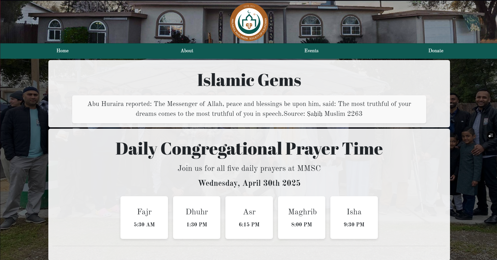
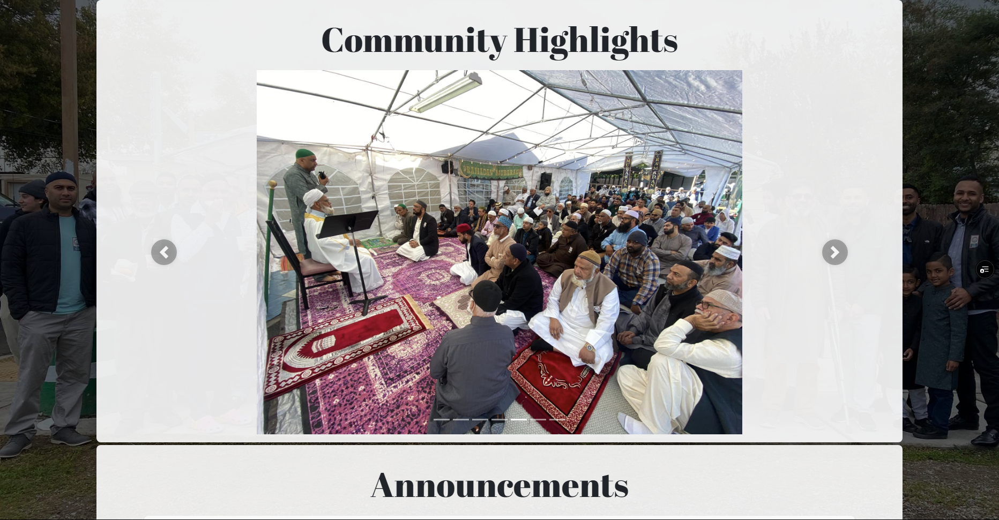
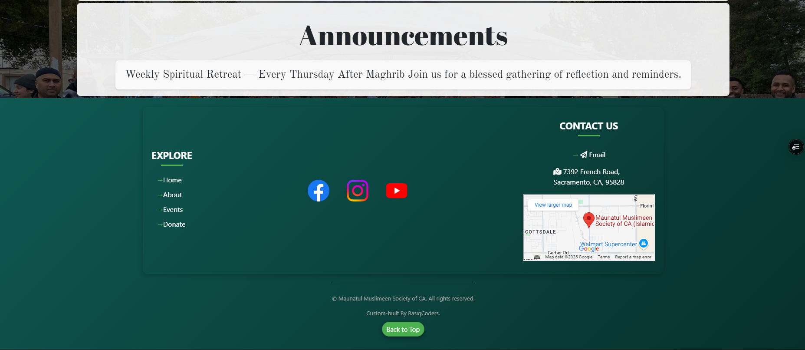
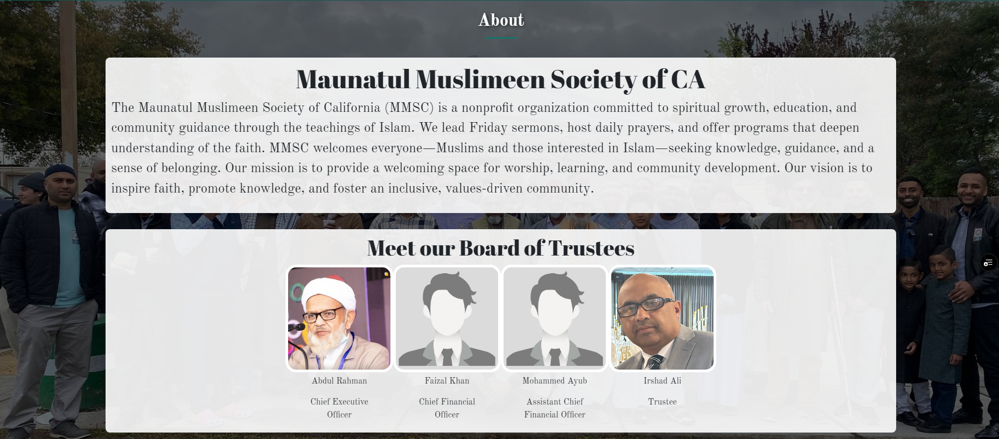
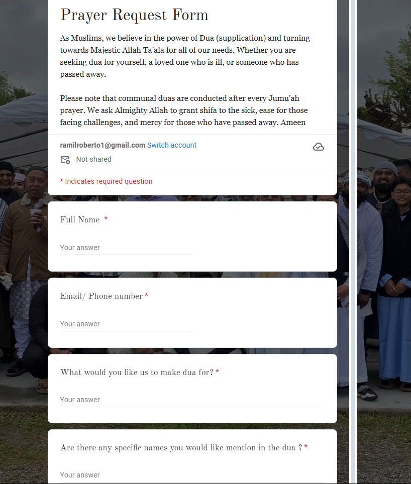
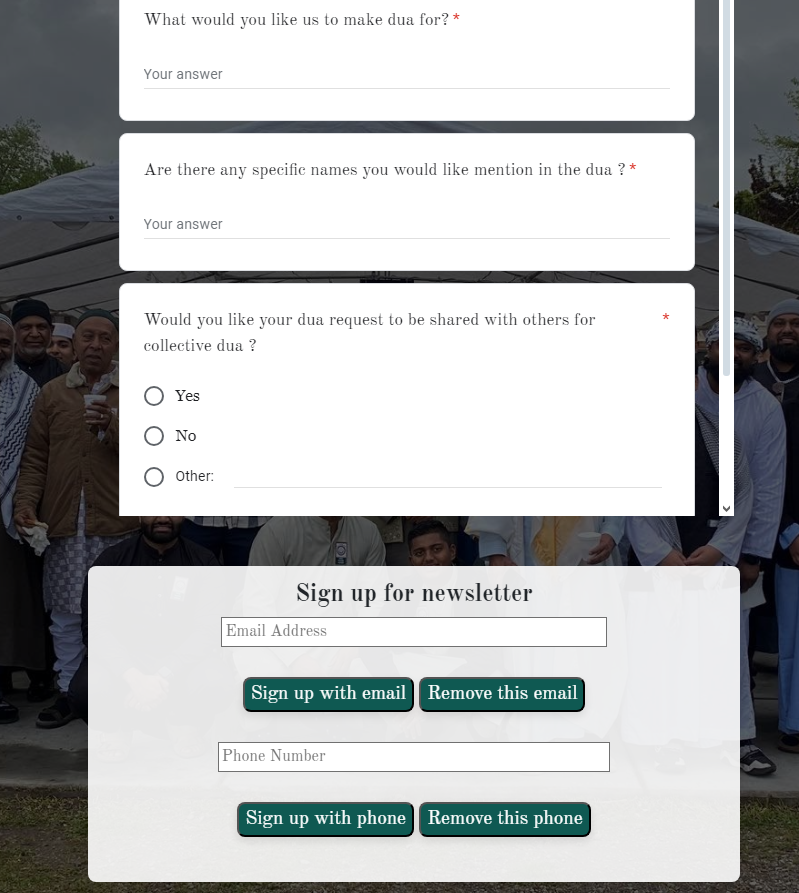
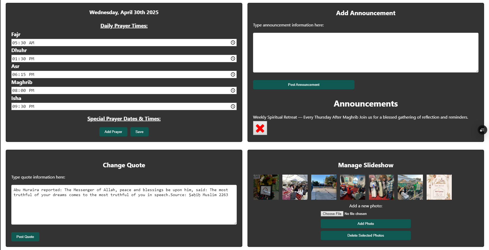
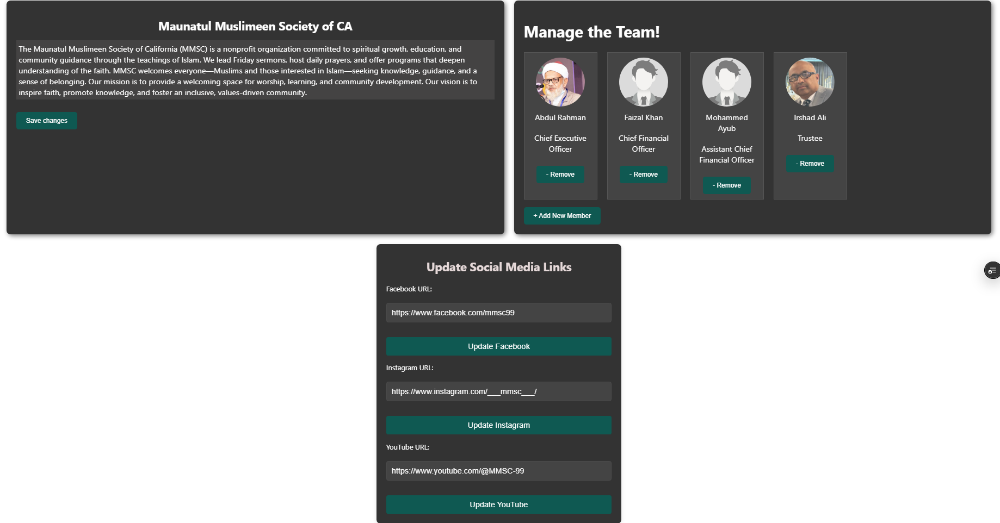
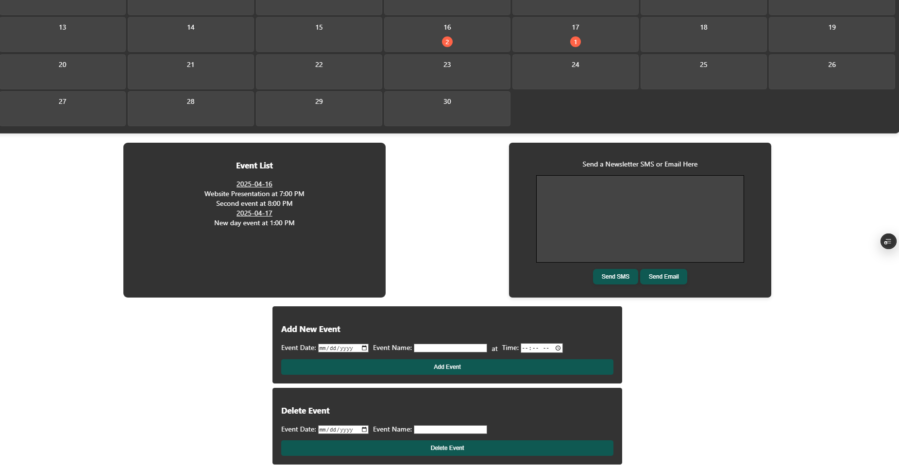
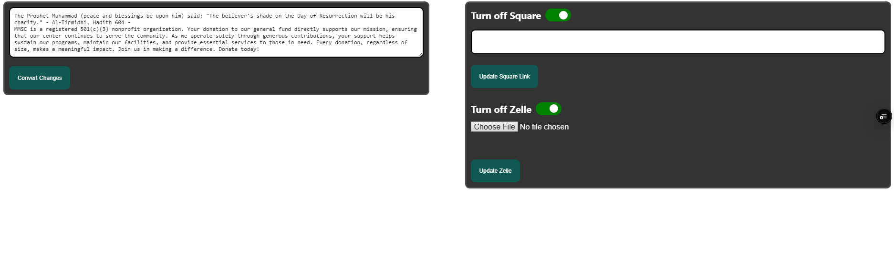

# Project Masjid
> Project Masjid is a website project for the Maunatul Muslimeen Society of California

## Meet the Team: 
  - Mark Ures &nbsp;&nbsp;&nbsp;&nbsp;&nbsp;&nbsp;&nbsp;&nbsp;&nbsp;[LinkedIn](https://www.linkedin.com/in/mark-ures-245022363/)
  - Roberto Ramil &nbsp;&nbsp;&nbsp;[LinkedIn](https://www.linkedin.com/in/roberto-ramil-297a6b89/)
  - Corliss Yang &nbsp;&nbsp;&nbsp;&nbsp;&nbsp;&nbsp;[LinkedIn](https://www.linkedin.com/in/corliss-y-06712a2a5/)
  - Shahroz Hamid&nbsp;[LinkedIn]()
  - Mansoor Ali &nbsp;&nbsp;&nbsp;&nbsp;&nbsp;&nbsp;&nbsp;&nbsp;[LinkedIn](https://www.linkedin.com/in/mansoor-ali-431901204/)
  - Giovany Nunez&nbsp;&nbsp;&nbsp;&nbsp;&nbsp;[Email](realgiovanynunez@gmail.com)
  - Iman Abboud &nbsp;&nbsp;&nbsp;&nbsp;&nbsp;&nbsp;[LinkedIn](https://www.linkedin.com/in/iman-abboud/)
  - Simon Vu Truong [LinkedIn]()

## Table of Contents
 - [What Project Masjid Is](#what-project-masjid-is)
   - [Technologies](#technologies)
   - [Entity Relationship Diagram](#entity-relationship-diagram)
 - [Testing](#testing)
 - [Deployment](#deployment)
 - [Developer Instructions](#developer-instructions)
 - [Prototype](#prototype-showcase)
 - [Current Project Showcase](#current-project-showcase)

## What Project Masjid Is
Maunatul Muslimeen Society of CA (MMSC) is a non-profit organization that provides prayer services to the local community. Per the client's request, BasiqCoders built a unique solution for their community by building a robust website for a way of fostering community among the attendees, providing important announcements, prayer times, and an admin portal for the leaders to add/update changes without requiring any coding by the user.
  
Project Masjid is led and implemented by the development team of BasiqCoders which is composed of undergraduate students majoring in Computer Science at California State University, Sacramento. The team comprises Iman-Tyson Abboud, Mansoor Ali, Shahroz Hamid, Giovany Nunez, Roberto Ramil, Mark Ures, Simon Vu Truong, and Corliss Yang.

### Technologies
Project Masjid utilizes the following technologies

Frontend:
 -  HTML - Website Design
 -  CSS - Website syle/formatting
 -  JavaScript - Handling of data 

Backend:
 -  Firebase - Database
 -  Node.js - Database and data handling
 -  Vercel - Webhosting
 -  AWS (SNS) - SMS/Email Service

IDE: Visual Studio
### Entity Relationship Diagram

## Testing
 - Programming Languages:
   - HTML
   - JAVASCRIPT
   - CSS
 - Libraries
   - Popper.js
   - Google Fonts fonts.gstatic fonts.googleapis
   - BootStraps
   - jQuery
   - Firebase
   - Cloudflare
 - IDE
   - Visual Studio Code

## Deployment
> TODO

## Developer Instructions
> Setup IDE:
The following software must be installed to maintain and locally run the environment for testing
 - Visual Studio 1.99.2
 - Java SE Runtime Environment 23.0.2+7-58
 - Git 2.46.2
 - NPM 10.9.0 (Installation instructions here)
   
Once these have been installed, some additional Visual Studio extensions are needed.
 - Live Server 5.7.9

This will add a button to the bottom right of Visual studio that will allow you to locally host the website on your computer. This will allow testing and viewing of potential changes before committing them to the live version of the website.
 - JavaScript (ES6) code snippets 1.8.0
   
This will add code previews and suggestion support to Visual studio to allow you to code more efficiently by providing autocompletions of current variables and JavaScript functions. Pull code from the repository. Once the above installations have been completed you can then clone the repository of the CodeBase onto your computer.
 - It is recommended to first create a directory on your computer which will be easy to navigate to for you to clone the repository into, this could be somewhere such as your desktop.
 - Once visual studio has been opened, clone the following repository to visual studio: https://github.com/RobertoRamil/ProjectMasjid cloning it to the directory you created in the step above.

> Merge Changes
 - To merge changes into the repository you must ensure that your final commit has been pushed to your branch and it is ready to merge. Navigate to the github repository online page and go to the “Pull Requests tab,” Chose the branches you wish to participate in the merge

 - If you wish for changes to be reflected on the live website choose main as the target and the branch you wish to merge as the second option and click the green “Create pull request” button. It may be necessary to handle conflicts within the Github editor. To do so, analyze the code and choose what code is to be kept. After this, simply navigate through the prompts and “Merge pull request”. This should immediately push the changes to vercel and replicate the changes on the live website.
To undo changes navigate again to the “Pull requests” page and remove all search filters to display all pull requests.

 - Navigate to the pull request you want to revert and simply click on it. This will bring you to the page dedicated to the pull request. Scroll down and you should see a “Revert” button. Using that will undo the pull request and unmerge the changes from main.

> Teams developed process
 - The process our team used during development was fairly standard. When changes were to be made we would navigate to the Remote Main branch and in the Source control in Visual studio fetch and pull all changes. This step is crucial in ensuring you will have a copy of the most up to date version of the code base before you begin to write any changes. Once you have the most current version of main, use the branch selection box at the bottom left of visual studio and “Create new branch…” Name the branch a descriptive but concise name. Our convention was to name the branch after the Jira issue code.

> New Branches
 - Now that a new branch has been set up, implement and test the changes you wish to be made. Once you are satisfied with all changes you will publish the branch by using the same branch selector at the bottom left.
 - Navigate to the source control and use the commit button to push your changes to your branch. Ensure your commit message is concise but descriptive so any other developers are informed as to what changes are occurring with this particular commit. After this process is complete, you can use the steps detailed in the “Merge Changes into the Repository” section above to reflect the created changes to the live website

## Prototype Showcase
Want to view our original prototype?
[Click here to download and explore it yourself!](https://github.com/RobertoRamil/ProjectMasjid/raw/refs/heads/main/readme/Prototype.zip)

## Current Project Showcase
The website is located [Here at mmscenter.org](https://mmscenter.org)

Below is an image showcase showwing off the various portions of the website, if you'd like to see everything the user side has to offer simply use the above link!

User Home page

User About Page

User Events page

Admin Home page

Admin About page

Admin adding calendar event

Admin Donation page

